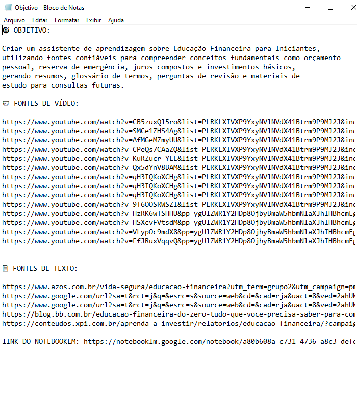
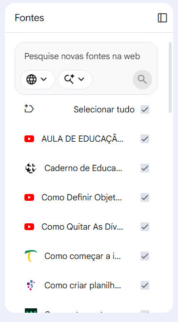
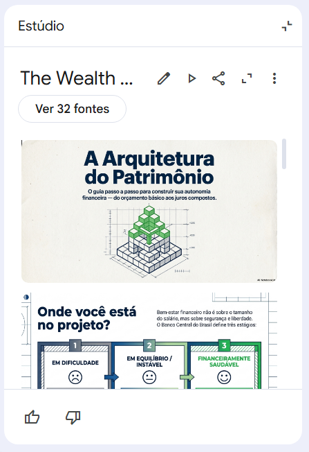
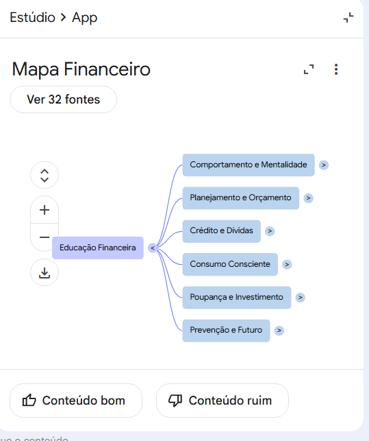

# 📚 Treinando uma IA de Aprendizagem com NotebookLM

## 🔗 NotebookLM do Projeto

Acesse o notebook desenvolvido durante o desafio:

👉 https://notebooklm.google.com/notebook/a80b608a-c731-4736-a8c3-defd30857ef0?authuser=1

---

# 🎯 Sobre o Projeto

Este projeto foi desenvolvido como parte do desafio **"Treinando uma IA de Aprendizagem: Explore o Poder do NotebookLM"** da DIO.

O objetivo foi utilizar o NotebookLM como ferramenta de aprendizagem ativa para estudar conceitos fundamentais de Educação Financeira para Iniciantes, explorando curadoria de fontes, engenharia de prompts e organização do conhecimento com apoio de Inteligência Artificial.

---

# 🎯 Objetivo de Estudo

O planejamento começou com a criação do arquivo **objetivo.txt**, onde foram organizados:

* Objetivo principal;
* Fontes de vídeo;
* Fontes de texto;
* Estratégia de pesquisa.

---

# 📂 Planejamento Inicial

Antes da criação do NotebookLM foi elaborado um documento contendo o objetivo de estudo e as fontes que seriam utilizadas.

## 📷 Arquivo objetivo.txt

---

# 🤖 Criação do NotebookLM

Após a definição do tema, foi criado um NotebookLM focado em Educação Financeira para Iniciantes.

Além das fontes previamente selecionadas, foi utilizada a funcionalidade:

> Pesquisar novas fontes na web

Com isso, foi possível expandir a base de conhecimento utilizando materiais sugeridos pela própria IA.

## 📷 Notebook criado

---

# 📚 Curadoria de Fontes

Foram utilizadas diversas fontes relacionadas aos seguintes temas:

* Educação Financeira;
* Reserva de Emergência;
* Planejamento Financeiro;
* Juros Compostos;
* Investimentos;
* Renda Fixa;
* Renda Variável;
* Consumo Consciente.

O NotebookLM consolidou mais de 30 fontes para análise e estudo.

## 📷 Fontes carregadas

---

# 💬 Engenharia de Prompts

Após o carregamento das fontes, foram realizados testes utilizando perguntas estratégicas.

---

## Prompt 01

### Pergunta

> Quais são as três fases para montar uma reserva de emergência?

### Resumo da Resposta

O NotebookLM identificou três etapas principais:

### Reserva Inicial

* Entre R$ 1.000 e R$ 3.000;
* Cobertura de pequenos imprevistos;
* Evita novas dívidas.

### Reserva Intermediária

* Entre R$ 4.000 e R$ 7.000;
* Maior segurança financeira;
* Cobertura temporária da renda.

### Reserva Completa

* Equivalente a 6 meses do custo de vida;
* Proteção contra crises financeiras;
* Base da segurança financeira.

Também foram apresentados:

* Tesouro Selic;
* CDB com liquidez diária;
* Contas que rendem CDI.

## 📷 Resultado do Prompt

---

## Prompt 02

### Pergunta

> Quais são as melhores opções para investir a Reserva Inicial?

### Resumo da Resposta

O NotebookLM recomendou:

* Tesouro Selic;
* CDB com liquidez diária;
* Contas digitais com rendimento CDI;
* LCI e LCA com liquidez diária.

Critérios destacados:

* Liquidez imediata;
* Baixo risco;
* Proteção contra inflação.

---

# 📖 Miniguia de Estudo

## Educação Financeira

Educação financeira é a capacidade de administrar recursos de forma consciente, planejando gastos, investimentos e objetivos de longo prazo.

---

## Reserva de Emergência

A reserva de emergência deve ser o primeiro objetivo financeiro de qualquer pessoa.

Características:

* Alta liquidez;
* Baixo risco;
* Fácil resgate.

---

## Juros Compostos

Os juros compostos representam o crescimento exponencial do dinheiro ao longo do tempo através dos chamados juros sobre juros.

---

## Investimentos

### Renda Fixa

Exemplos:

* Tesouro Selic;
* CDB;
* LCI;
* LCA.

### Renda Variável

Exemplos:

* Ações;
* ETFs;
* Fundos Imobiliários.

---

# 📚 Glossário

| Conceito        | Definição                                             |
| --------------- | ----------------------------------------------------- |
| Liquidez        | Facilidade de transformar um investimento em dinheiro |
| Rentabilidade   | Retorno obtido em um investimento                     |
| Risco           | Possibilidade de perda financeira                     |
| CDI             | Taxa de referência para diversos investimentos        |
| Tesouro Selic   | Título público indicado para reserva de emergência    |
| Inflação        | Aumento geral dos preços                              |
| Juros Compostos | Juros calculados sobre juros acumulados               |
| Ativo           | Bem que gera renda                                    |
| Passivo         | Bem que gera despesas                                 |
| Diversificação  | Distribuição dos investimentos para reduzir riscos    |

---

# 🔄 Prompts Reutilizáveis

* Crie um resumo dos conceitos presentes nas fontes.
* Explique o conteúdo para um iniciante.
* Gere um glossário dos termos mais importantes.
* Crie questões de revisão com respostas.
* Monte um plano de estudos baseado nas fontes.
* Compare renda fixa e renda variável.
* Explique utilizando exemplos práticos.

---

# 🎬 Recursos Gerados pelo NotebookLM

Durante o desenvolvimento também foram utilizados recursos multimídia da plataforma.

✅ Resumo em Vídeo

✅ Apresentação de Slides

✅ Infográfico

## 📷 Resumo em Vídeo

## 📷 Apresentação

## 📷 Mapa Mental

---

# 🚀 Conclusão

O NotebookLM demonstrou ser uma ferramenta extremamente eficiente para aprendizagem ativa, permitindo consolidar dezenas de fontes em uma única base de conhecimento, gerar respostas contextualizadas, produzir materiais de revisão e criar recursos multimídia para apoio aos estudos.

Além do aprendizado em Educação Financeira, este projeto permitiu desenvolver habilidades em curadoria de conteúdo, organização do conhecimento e engenharia de prompts utilizando Inteligência Artificial.
